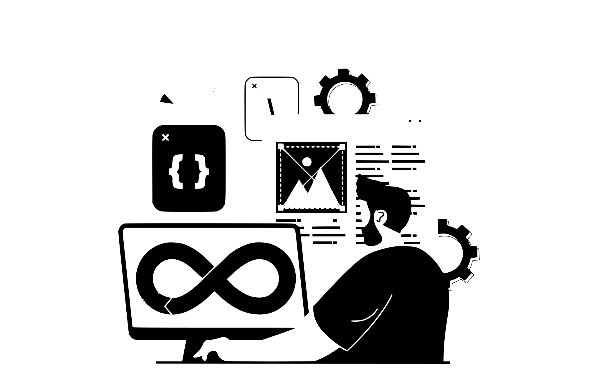

<h2>Hello World ☕</h2>

Olá, sou o Rodrigo Lucas, desenvolvedor fullstack! Atualmente, sou criador de conteúdo no Youtube. Sou apaixonado por tecnologia e amo ajudar pessoas.

 

<h3>Caso queira acompanhar meus conteúdos:</h3>

  

